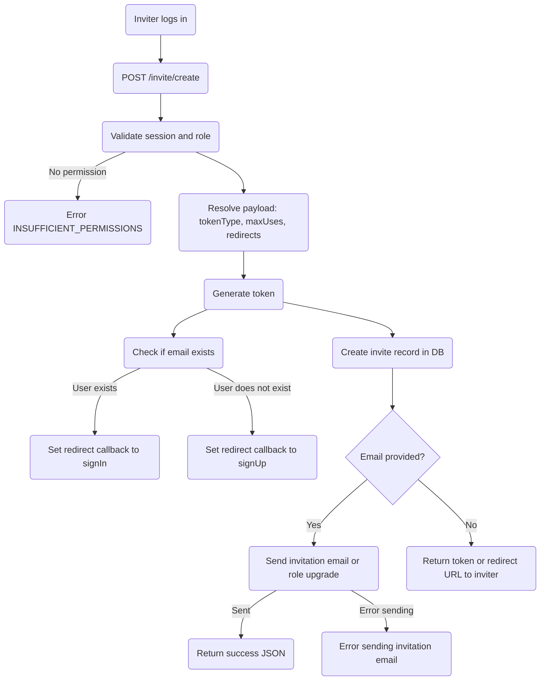
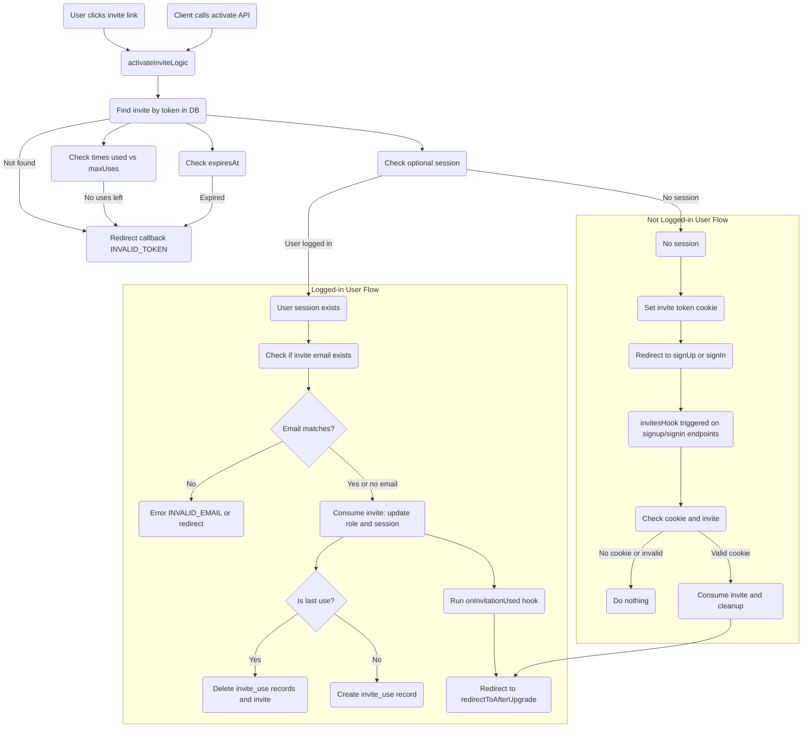

# Invite Creation

This diagram shows how an inviter creates an invite, including validation, token generation, and email sending.

<Callout type="info" title="Note" className="hidden md:flex">
  To move and zoom the diagram, hold the **Alt** key and use your mouse wheel or click and drag.
</Callout>

# Invite Activation

This diagram shows the full invite activation flow, including both logged-in and not logged-in users, with validations, role updates, hook execution, and final redirection.

